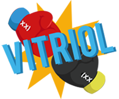
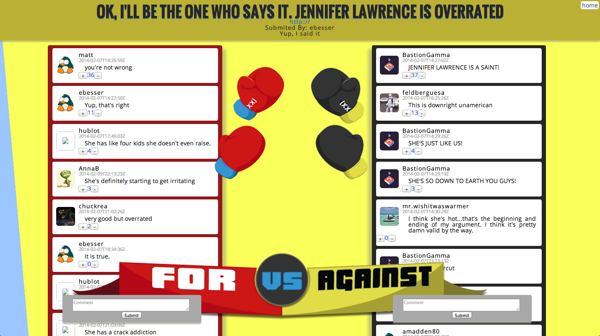

#[Vitriol](http://vitriol.herokuapp.com/)


###Because who doesn't love to argue on the internet?

##Product Description
Vitriall leverages the power of virtual conflict by allowing users to submit and discuss topics they are interested in. Unlike many other online communities, Vitriall lets users pick certain sides of a specific argument and gives them the opportunity to convince the  community that their side is right. The side with the most upvotes and traction wins!

Vitriall was build on RoR with the help of mighty Javascript.



##Code Snippet
Multiple AJAX database calls within the User Controller

```ruby
 def following 
    respond_to do |format|
      format.json do
        user = User.find(params[:user_id])
        follows = Follow.where(user_id: user)
        follows_array = []
        follows.each do |follow|
          follows_array << {:topic_id => follow.topic_id, :topic_name => Topic.find(follow.topic_id).title}
        end
        unique_follows = follows_array.uniq
        render :json => unique_follows
      end
    end
  end
```
Example of the code from the interative comments section which allows users to literally throw punches at the opponents argument

```
var punchFor = function(){
  var forFist = $('#for_fist_front');
  var opponent = $("#fighter2");

  forFist
    .css({
      backgroundPosition: "0 -148px",
      width: "404px"
      })
    .animate({marginLeft: "100px", marginTop: "-50px"},50, function(){
      $(this).css({
        backgroundPosition: "0px -279px",
      })
    })
    .delay(60)
    .animate({marginLeft: "150px"},50, function(){
      $(this).css({
        backgroundPosition: "-269px 0px",
        width: "145px"
      })
    })
    .animate({marginLeft: "0px", marginTop: "0px"},300, function(){
      $(this).css({
        backgroundPosition: "-264px 0"
      })
    })

  opponent.delay(1)
      .transition({ rotate: '12deg' })
      .delay(5)
      .transition({ rotate: '-5deg' })
      .transition({ rotate: '0deg' });
};

```
